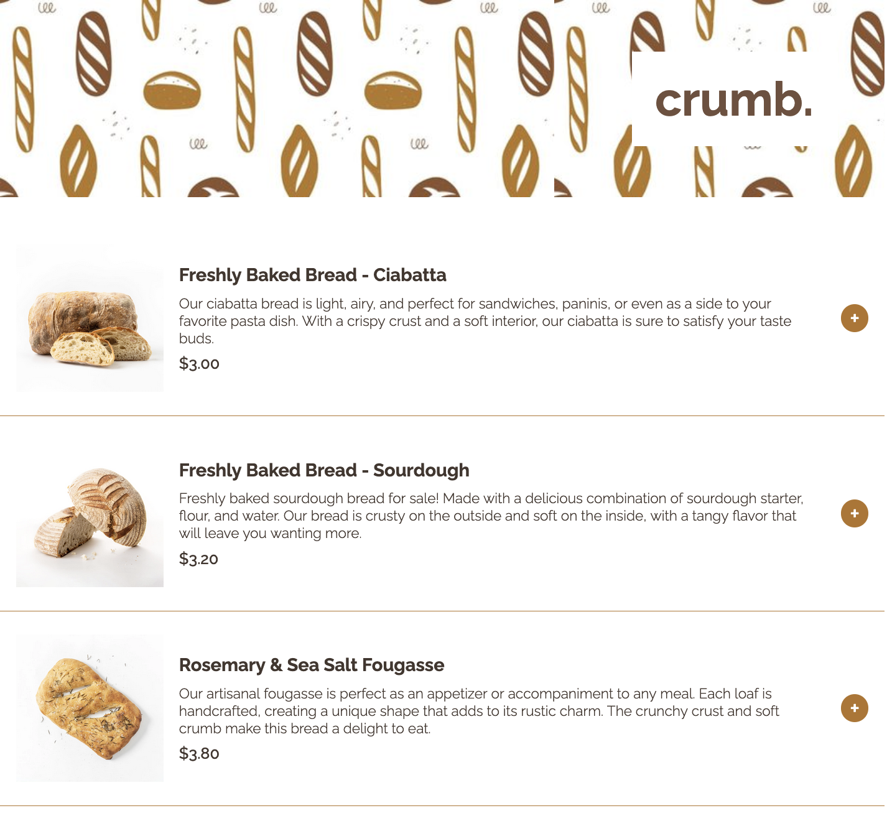
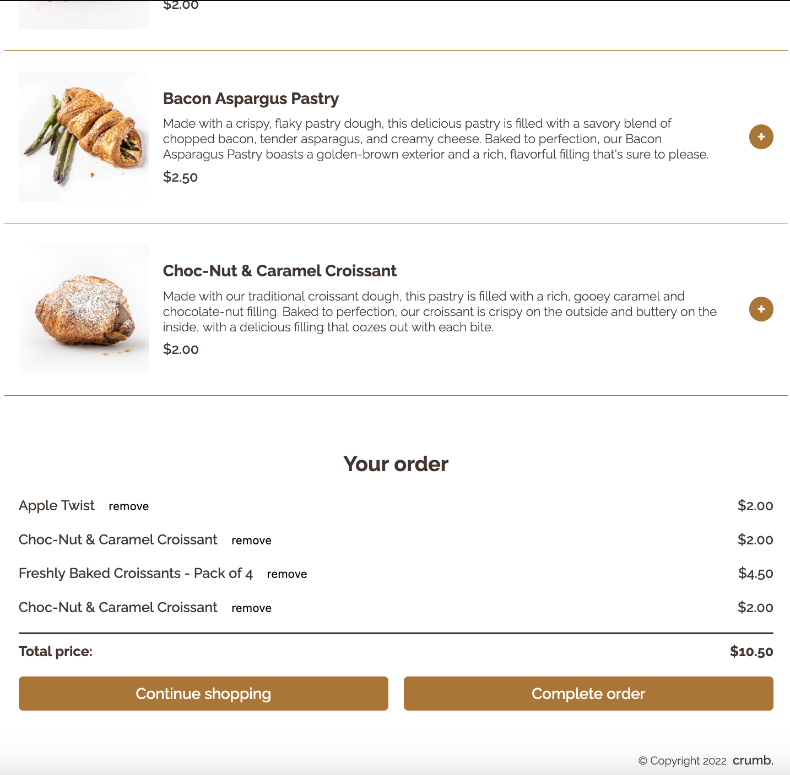
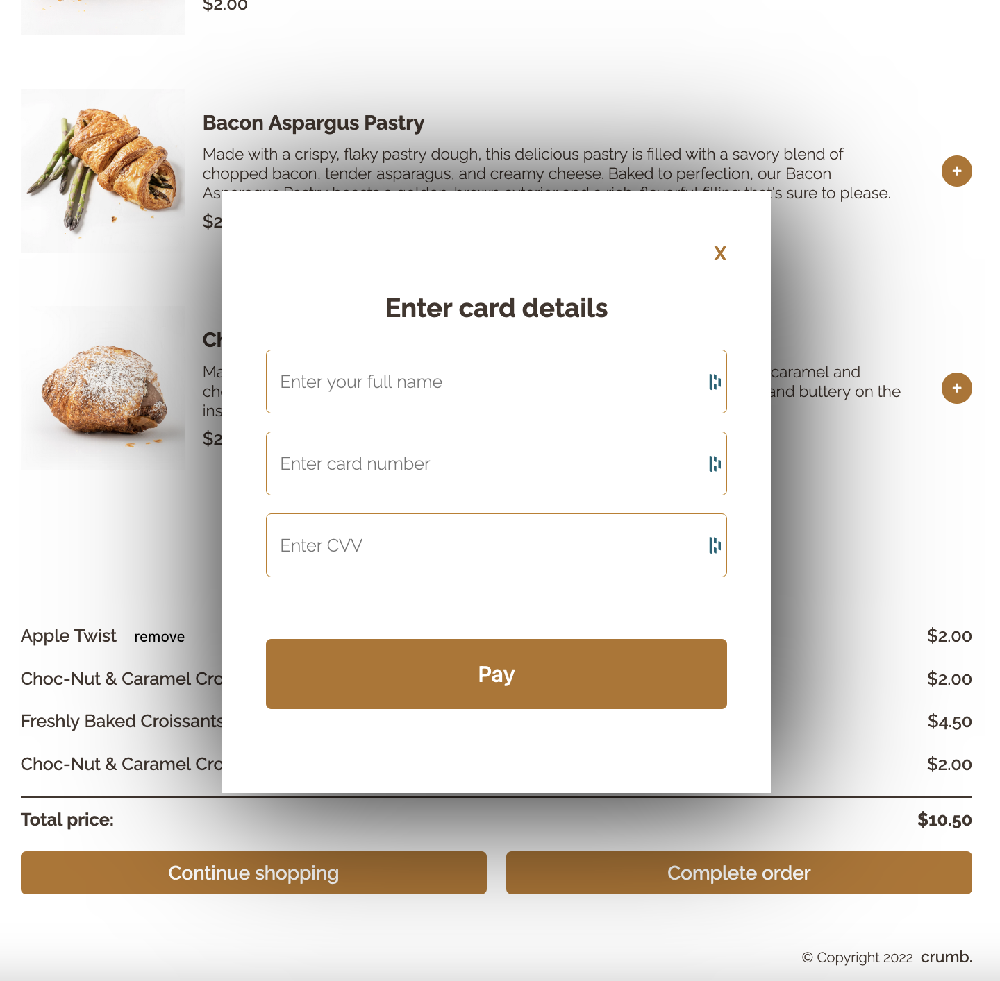

# crumb. 🥖 Bakery Ordering App 

#### ✨ Deployed/demo version 

## Demo overview
This app allows the user to order baked goods, available in desktop and mobile versions. 
The user adds the desired products to the order, where the total cost is calculated. 
The user is then taken to the payment modal and receives a personalised order confirmation.

Possible actions:
- Adding individual products to the order
- Removing products from the order
- Proceeding with the payment
- Receiving a personalised order confirmation

## Developer overview
This is a simple app built to practice my JavaScript learning. 
- This app contains a data file with an object for each item available for sale
- The items for sale displayed on the screen are rendered in the JavaScript by mapping over the array of objects and creating the HTML
- There is functionality to add items to the order and update the price as items are added of removed 
- There was conditional rendering used to display the order summary
- The payment form is displayed in a model and the order confirmation makes use of the client's name to confirm the order

 

 
 

## Author: 
👩‍💻 Rebecca Louw 

## Built with:

  
 
  
